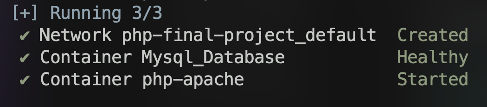

# PHP - Tamwood Final Project

    

        <strong>Project Requirements</strong>
    

**Your time has been assigned to create a full-stack web application for a Hotel. The customer request the following features:**

- Hotel Customers can search, view and book a room for their desired date.

- Hotel customers should not be able to see already occupied rooms within the selected reservation dates.

- Hotel customer should be able to leave comments, request specific services (Breakfast, lunch, dinner, parking and etc.),
- These services should be available or preferably suggested to the customer at the time of booking.
- Hotel customers should be able to fill their wallet when logged into their account.
- Hotel staff should be able to approve bookings, add/remove rooms, services, images and all other possible management related to the hotel rooms.

- Hotel Admin should be able to add/remove users (staff or customer), unlock a blocked user, and perform the same management as staff.
- Security considerations:
  Audit generation for the following events: [Authentications, Registrations, Room book approval, and filling the wallet.]

  Session in-activity period should be set by the admin and in-active session should be terminated accordingly.

  User locking mechanism after 5 unsuccessful attempts. 1st lock for 4 hours, 2nd lock for 10 hours, and 3rd lock permanent only unlocked by the admin.

    
<strong>Initial Config 😎</strong>

### Starting Docker

- Go to the Docker [Website](https://www.docker.com/products/docker-desktop/) 👈👈

- Download docker desktop for you computer.

- You can check the installation requirements for Windows 11 in this link [Docker Docs](https://docs.docker.com/desktop/install/windows-install/).

- If you're having trouble to do the initial installation in Windows 11, there's also this video that explains. [Youtube](https://www.youtube.com/watch?v=WDEdRmTCSs8) 📺

#### Running:

- Always check that you are in the folder
  that contains the `docker-compose.yml`.

Run the command: `docker compose up -d`

Wait for the response:

- Should be like this:
  

#### Accessing the PHP backend

The backend is set to the port `8080` of the `localhost`.

- `http://localhost:8080/`
- It will look for the index.php file.
- All files and folders need to be created within the folder `/backend`.

#### Database Access

Database being used is `MySql`.

- It is mapped to the default port `3306`
- Default user is `root`.
- Default passwod is `root123`

Use any **_SGBD/DBMS\*_** to access it. 
\*Database Management System.

### Team Members 🤜 🤛

- [Victor Araujo](https://github.com/victor-web-dev) 🇧🇷
- [Joao Soares](https://github.com/jsoares1310) 🇧🇷
- [Mina Lee](https://github.com/minimanimox) 🇰🇷
- [Diego Cevallos](https://github.com/dieceva) 🇵🇪
